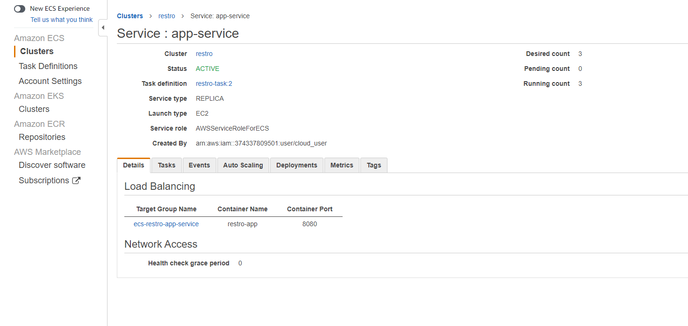

# Creating a CI/CD pipeline for an web app using github Action with ECS Cluster

App Code: 
    [code link](https://github.com/niranjan-cell/restro-application)

> ### Installing Docker and Maven 
```sh 
sudo yum install docker
sudo systemctl start docker
sudo systemctl enable docker
sudo usermod ec2-user -aG docker
# installing maven
sudo wget https://repos.fedorapeople.org/repos/dchen/apache-maven/epel-apache-maven.repo -O /etc/yum.repos.d/epel-apache-maven.repo
sudo sed -i s/\$releasever/6/g /etc/yum.repos.d/epel-apache-maven.repo
sudo yum install -y apache-maven
sudo yum install java-1.8.0-devel
sudo /usr/sbin/alternatives --config java
#select java 8
sudo /usr/sbin/alternatives --config java
#select java 8
```
> ### Creating Docker file
```
sudo vi Dockerfile
```
```Dockerfile
FROM centos:7

RUN yum install java -y

RUN java -version

RUN mkdir /opt/tomcat

WORKDIR /opt/tomcat

RUN curl -O https://mirrors.estointernet.in/apache/tomcat/tomcat-10/v10.0.20/bin/apache-tomcat-10.0.20.tar.gz

RUN tar -xvf apache-tomcat-10.0.20.tar.gz

RUN mv apache-tomcat-10.0.20/* /opt/tomcat

COPY target/restro.war /opt/tomcat/webapps

EXPOSE 8080

CMD [ "/opt/tomcat/bin/catalina.sh", "run" ]
```
> ### Creating .war file and  Creating Docker image and adding tags and hosting it on docker hub
```sh
mvn validate compile package
docker build -t restro-application .
docker image tag restro-application  niranjanchavan/restro-application:latest
ls
docker image ls
docker login
docker push niranjanchavan/restro-application
```
> Creating cluster


> Creating a Task


> Creating a Service


```text
Creating a application load balancer and creating a target group  and adding that to ECS service and changing the lsitening rule for application balancer
```


# :) Working 


> ### Moving for "GitHub Action"

1. Creating the directory .github/workflows/
    ```sh
    mkdir -p .github/workflows/
    cd .github/workflows/
    ```
2. vi deploy.yml
    ```yml
    name: Deploy to AWS ECS cluster

    on:
     push:
       branches:
         - "main"

    env:
     AWS_REGION: ap-south-1
     ECS_SERVICE: app-service
     ECS_CLUSTER: restro
     CONTAINER_NAME: restro-app

    jobs:
      app_pipeline:
        name: "Restro-Deploy"
        runs-on: "ubuntu-latest"
        steps:
          - name: "App Code Checkout"
            uses: actions/checkout@v2
      
      - name: Setup of JDK 11
        uses: actions/setup-java@v3
        with:
          distribution: 'adopt'
          java-version: '11'
    
      - name: Build Application using Maven
        run: mvn clean compile package

      - name: Set up Docker Buildx
        uses: docker/setup-buildx-action@v2

      - name: Docker login
        uses: docker/login-action@v2
        with:
          username: ${{ secrets.DOCKERHUB_USERNAME }}
          password: ${{ secrets.DOCKERHUB_PASSWORD }}

      - name: Docker Build and push to DockerHub
        uses: docker/build-push-action@v3
        with:
          context: ./
          file: ./dockerfile
          push: true
          tags: |
            ${{ secrets.DOCKERHUB_USERNAME }}/restro-application:latest
            ${{ secrets.DOCKERHUB_USERNAME }}/restro-application:${{ github.sha }}
      
      - name: Configure AWS Credentials
        uses: aws-actions/configure-aws-credentials@v1
        with:
          aws-access-key-id: ${{ secrets.AWS_ACCESS_KEY_ID }}
          aws-secret-access-key: ${{ secrets.AWS_SECRET_ACCESS_KEY }}
          aws-region: ${{ env.AWS_REGION }}

      - name: Download Amazon ECS task definition
        run: | 
         aws ecs describe-task-definition --task-definition restro-task --query taskDefinition > task-definition.json
         cat task-definition.json

      - name: Replace Docker image ID and create new Task definition
        id: task-def
        uses: aws-actions/amazon-ecs-render-task-definition@v1
        with:
          task-definition: task-definition.json
          container-name: ${{ env.CONTAINER_NAME }}
          image: ${{ secrets.DOCKERHUB_USERNAME }}/restro-application:latest

      - name: Deploy Amazon ECS task definition
        uses: aws-actions/amazon-ecs-deploy-task-definition@v1
        with:
          task-definition: ${{ steps.task-def.outputs.task-definition }}
          service: ${{ env.ECS_SERVICE }}
          cluster: ${{ env.ECS_CLUSTER }}
          wait-for-service-stability: true

      - name: Slack Notification
        uses: 8398a7/action-slack@v3
        with:
          status: ${{ job.status }}
          text: "The CI/CD Pipeline for Restro project executed successfully"
          fields: repo,message,commit,author,action,eventName,ref,workflow,job,took,pullRequest # selectable (default: repo,message)
          channel: "ci-cd_pipeline"
        env:
          SLACK_WEBHOOK_URL: ${{ secrets.SLACK_WEBHOOK_URL }} # required
        if: always() # Pick up events even if the job fails or is canceled.
    ```

  
  3. Adding the secret to repository
  
  
  4. Creating Slack hook for slack notification.
   
   

  5. After Commiting the code to main branch from branch Niranjan
      ```git
      git checkout -b niranjan
      git add .
      git commit -am "workflow commit"
      ```
      Mearging Changes in Github

      

  6. Results 
      CI/CD working properly
      
      
      
> # Thank you 